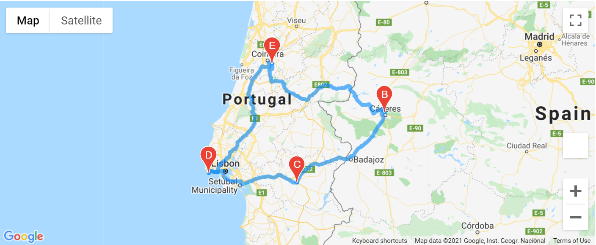
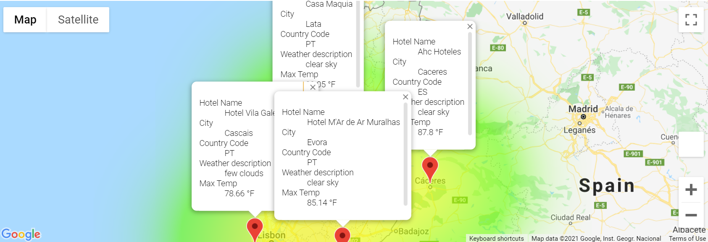

# WeatherPy with Python APIs

## Purpose of the analysis:

The purpose of the analysis is to add new functionalities to the PlanMyTrip app, as suggested by Beta testers to significantly improve the customer experience when using the app.
Specifically, we will be adding weather description to weather data to allow beta testers to filter the data for their weather preferences, which will be used to identify potential travel destinations and nearby hotels, of which beta users will choose four cities to create a travel itinerary.
One of the added functionalities will also be to create a travel route between the four cities as well as a marker layer map. 

  
 

